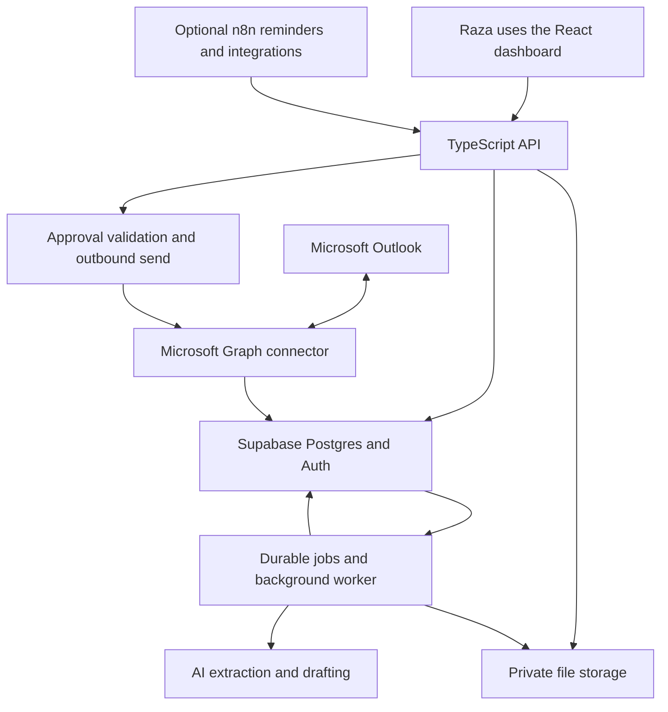

# DCX business automation architecture plan

Planning draft prepared 15 September 2026. This document proposes the next implementation. It does not change application code, connect accounts, import mail, or send messages.

## Recommendation

Keep the existing React dashboard. Build a small TypeScript backend with Microsoft Graph email integration, Supabase Postgres, Supabase Auth, private Supabase Storage, and one background worker. Use the OpenAI API for classification, extraction, retrieval-assisted drafting, and document summaries. Choose the model through a pilot using representative client emails and documents.

n8n is optional. Add it for reminders and integrations if visual workflow maintenance is useful. Keep pricing, approvals, and the canonical send operation in the backend so every workflow follows the same rules.

Confirmed operating scale: one Microsoft mailbox, approximately 10–20 incoming emails per day, and one dashboard user. This is approximately 300–600 incoming messages per 30-day month. Historical imports and large tender attachments are the likely processing spikes. A single application with modules and a durable job queue is appropriate; multiple business databases and distributed services are unnecessary initially.

## What the existing project actually provides

Read-only review of `src/App.tsx`, `src/lib/calculator.ts`, `src/lib/supabase.ts`, `src/types/crm.ts`, the rate/settings/inbox components, and `supabase_schema.sql` found:

- The React screens provide a reusable starting point for inbox, customers, pricing, quotes, and reporting.
- Core records initialize from mock data and changes remain in React state. Approval/send handlers update status and show success messages without calling Microsoft Graph. This review does not establish anything about a separate deployed system.
- Supabase client initialization and a connection test exist. The main actions inspected are not wired to durable database operations.
- The supplied schema has a customer table, an asset table, one operational-rate configuration, a product catalog, quote totals, email logs, and manual embeddings.
- It lacks the proposed separate contacts/sites, partner price agreements, rate versions, quote revision/line records, complete message/attachment records, tender requirements, durable jobs, and approval/outbound-send records.
- The supplied SQL does not define row-level security policies. Production access controls need an explicit implementation.
- The calculator has fixed maintenance base amounts, a fixed tax assumption, and global pricing. These are prototype assumptions, not verified client commercial rules. Maintenance must support the requested 1–5-year schedules rather than only the present 1/3/5-year choices.
- Draft quote creation currently increments a sent-quotes statistic. Production reporting should derive metrics from stored lifecycle events.

## Architecture and ownership

Use Node.js and TypeScript for the API, with a small framework such as Fastify. Keep one codebase with modules for email, customer records, pricing, quotations, tenders, and approvals. Run time-consuming document work in a worker process, with Python helpers where useful for Office/PDF processing.

Begin with a Postgres-backed durable queue and one worker. Store job state, retry count, next attempt, failure details, and processing checkpoints. Acquire jobs with leases/locking so restarted workers do not process them concurrently. Add workers only when measured backlog requires them. If n8n is introduced, give each task a single owner; do not duplicate the mail poller or send pipeline in n8n.

Hosting should provide HTTPS, scheduled/background execution, encrypted secrets, logs, and restart support. Final provider and region depend on the client's data-location requirements. Supabase can support the database, authentication, file metadata, and optional semantic search in one platform. [Supabase database overview](https://supabase.com/docs/guides/database/overview)

## Storage and database choices

| Information | Proposed storage | Reason |
| --- | --- | --- |
| Customers, sites, equipment, prices, quotes, jobs and approvals | Postgres in Supabase | Records have relationships and need reliable transactional updates |
| Original emails exported as files, attachments, generated quotes and bid packages | Private object storage | Preserve the original files; store references and metadata in Postgres |
| Searchable email/document text | Postgres full-text search | Good starting point for names, model numbers, serial numbers and tender IDs |
| Meaning-based search over approved documents | Optional pgvector in the same Postgres database | Retrieve relevant passages without a separate vector-database service |

Start with ordinary database queries and text search. Add embeddings where the pilot shows a benefit. Supabase supports pgvector for similarity search. [pgvector documentation](https://supabase.com/docs/guides/database/extensions/pgvector)

MongoDB, Firebase, a standalone vector database, Redis, and a separate CRM are not proposed dependencies for this first version. This is a design choice for the small scale and strongly related business records, not a claim that these tools cannot work.

### Proposed logical records

These are table groups for schema design, not a requirement to ship every future module immediately.

| Group | Main records |
| --- | --- |
| Access | users, roles, business workspaces |
| Customer relationships | organizations, contacts, contact email aliases, sites, organization-site relationships |
| Equipment and service | assets, service events, warranties, maintenance agreements |
| Work tracking | cases/opportunities, tasks, case-message links |
| Mail | mailbox connections, folder sync checkpoints, threads, individual messages, attachments |
| Pricing | products/services, supplier costs, price books, versions, rate items, customer agreements, agreement scopes |
| Quotes | quotes, revisions, lines, assumptions, exclusions, approval records |
| Tender packages | tenders, documents/versions, addenda, requirements, extracted facts, field mappings, deliverables |
| Reusable business knowledge | approved company facts, staff profiles, reference projects, certificates, templates, document chunks |
| Reliability | jobs, outbound messages, send attempts, audit events, integration health |

Link every extracted fact to its source message or document and the relevant page, section, or spreadsheet cell. Record whether it is proposed, reviewed, superseded, or disputed. Preserve unknown values as unknown.

Model BGIS, its end customer, and the physical site separately. For example: BGIS is the quoting/billing relationship; a bank is the end customer; a branch is the service site. Contracts may differ across BGIS-managed portfolios. The site name alone must not determine the price book.

## Email history and customer memory

Use both stored business records and email history. Reading only the latest thread loses earlier jobs and quotes. Feeding the entire mailbox into every AI request adds cost and can mix unrelated customers.

For each new request:

1. Synchronize the individual message and attachments from Microsoft.
2. Resolve the contact, contracting organization, end customer, site, and active case. Flag ambiguous matches for review. Do not identify a contractual rate solely from a sender display name or domain.
3. Load the relevant conversation, previous linked conversations, approved equipment/service records, open work, and applicable commercial agreement.
4. Retrieve relevant approved manuals and source passages.
5. Draft a response with a visible list of missing information and sources.
6. Save the draft, decisions, and proposed fact updates. Raza can correct the relationship or facts from the dashboard.

Store a concise customer/case summary as a convenience, with links to underlying records. Rebuild it when new information changes the situation. A summary is not proof that all history has been imported.

### Microsoft integration

Use Microsoft Graph through OAuth. Begin with scheduled incremental synchronization, for example every 2–5 minutes, plus a manual refresh. This proposed interval is for administrative intake, not an emergency response guarantee. Add change notifications if faster arrival updates become necessary.

Import Inbox, Sent Items, and relevant archived/custom folders. Graph delta synchronization operates per folder, so maintain a separate checkpoint for each tracked folder. [Microsoft delta synchronization](https://learn.microsoft.com/en-us/graph/delta-query-messages)

Keep Graph immutable IDs, mailbox IDs, conversation IDs, Internet Message-ID and reply references. Deduplicate message ingestion on a stable mailbox/message identity. Microsoft documents immutable IDs for tracking Outlook objects through folder moves within a mailbox. [Microsoft immutable IDs](https://learn.microsoft.com/en-us/graph/outlook-immutable-id)

Reply using Microsoft's reply-draft operation and send through the original mailbox. Preserve recipients, CC, attachments, and reply context. Synchronize replies that Raza sends directly in Outlook as well. [Microsoft createReply](https://learn.microsoft.com/en-us/graph/api/message-createreply?view=graph-rest-1.0)

Display independent states for email processing, draft review, and sending. Approval means permission to send a specific revision. Provider acceptance and sent-item reconciliation are later events; neither proves recipient delivery. On a timeout after sending, reconcile the result before retrying to avoid duplicate customer emails.

### Historical and bulk import

- Establish whether the supplied bulk material is an email address list, mailbox access, PST/MBOX/EML exports, or a combination. Address lists cannot provide conversation history.
- Prefer Graph for history still in the mailbox. Add an import adapter for the actual export format if necessary.
- Import recent history and active customers/cases first, then the agreed older archive in batches. Show date/folder coverage and unresolved import failures.
- Preserve originals; hash attachment contents to detect exact duplicates. Files named `(2)` may be duplicates, but check contents before deciding.
- Exclude temporary Office lock files beginning `~$` from document processing.
- Classify historical mail without sending replies or triggering overdue follow-ups. Mark imports explicitly so historical messages cannot enter the live send flow.
- Review uncertain contact merges and asset facts. Existing quotes remain historical evidence, not today's default rates.

## Pricing and BGIS agreements

The dashboard should have a Pricing and Agreements section with Standard, BGIS, and future partner price books. Support independent product and service rates, rather than assuming BGIS is a flat discount from Standard.

The Standard MOPs/WSIB/Rates ZIP contains a service-rate PDF effective 1 October 2024. Its text specifies contract and non-contract categories, a four-hour minimum call charge, and validity of 30 days from the effective date. Treat it as historical rule evidence until Raza confirms a current schedule. The document does not establish that its contract category is the BGIS agreement. The PDF's table values were not visually reconciled, so this review does not certify the individual rates or their column mapping.

### Rate selection

Proposed precedence:

1. An explicitly approved override for the current quote revision.
2. The applicable customer/site contract or tender-specific agreement.
3. The customer's active price book, such as BGIS.
4. Standard pricing for customers without a specific agreement.

If an agreement exists but is expired, ambiguous, or missing the required item, stop for a pricing decision. Standard fallback for uncovered partner items must be an explicit approved rule, not an accidental default.

### Fields Raza should be able to change

Product costs and sell rates; normal/emergency/after-hours labour; technician count and minimum hours; travel distance rules, time and mileage; callout; shipping; disposal; rentals; subcontractors; contingency; margin or markup policy; service frequency; maintenance years 1–5; taxes and jurisdiction; quote validity; exclusions; agreement scope and effective dates.

Import existing spreadsheets into a draft price book, preview differences, and publish after review. The database becomes the live pricing authority. Preserve Excel import/export for convenience, with controlled publication so two conflicting rate sources do not develop.

### Changes over time

Rates have versions and effective-from/effective-to dates. Publishing a new version must not overwrite historical prices. Show a change history, user, reason, and affected draft quotes.

Each quote revision stores its exact line prices, quantities, selected rate version, costs, tax basis, assumptions, and calculation version. Sent/accepted quotes retain those values. A new price list can flag an unsent quote as stale and offer recalculation. Recalculation or any change to recipients, attachments, scope, or amount invalidates the old approval.

At send time, check current applicability of the selected rates. Require recalculation or a recorded decision to honour the prior rate when necessary. Contracts can legitimately fix prices or specify escalation; a published catalog update must not silently override a signed agreement.

### Calculation ownership

AI extracts requested quantities and scope and proposes missing questions. Backend code performs validated calculations using decimal money and approved rules. Distinguish markup on cost from margin on selling price. Keep cost information separate from customer-facing prices and files.

Before live quoting, reconcile the implementation against Raza's actual cost workbook and approved Standard/BGIS sheets. The legacy `.xls` cost workbook's formulas and actual commercial rates have not been validated in this planning review.

## Tender and Metrolinx workflow

Create one tender case for the incoming email and its related documents. A tender can later include multiple threads and addenda.

The inspected sample contains a revised Addendum No. 5 pricing workbook, tender forms, staff experience information and WSIB documents. The workbook contains Summary, Rail, Stations, Bus Facilities & BRT and other sheets. The forms cover bidder qualifications, reference projects, conflicts, mandatory requirements, safety performance, workforce, vendor personnel, and attestations. This requires structured bid preparation beyond generating an email quote.

The Addendum No. 2 memo explicitly identifies replacement documents and an additional Appendix K. The reviewed file inventory does not establish that every referenced replacement is present. The system must detect missing references and record which document versions govern each requirement. An Addendum No. 5 pricing workbook does not prove every other file is current. This sample is a historical planning example; its deadline and eligibility have not been verified for a live submission.

### Proposed workflow

1. Register the package, attachment manifest, origin email, tender number, owner, and source-backed deadlines with time zones.
2. Inspect document types and extract content: PDF text/OCR where needed, Word paragraphs/tables/fields, and Excel labels, values, formulas, comments and hidden sheets where relevant. Do not run embedded macros.
3. Identify duplicates, addenda, superseded sections, missing referenced files, and conflicting instructions. Keep partial replacement scope, rather than assuming every new file replaces the whole package.
4. Build a requirements matrix: requirement, source location, current governing version, proposed answer, supporting evidence, missing information, reviewer and status.
5. Extract sites, assets, service frequencies, contract years, optional years, quantities, exclusions and pricing schedules. Distinguish estimates/options from committed quantities.
6. Pull approved company facts, relevant staff profiles, reference projects, insurance/WSIB evidence and their expiry dates from the reusable library.
7. Draft cost calculations and fill mapped cells/fields in copies of the required templates. Familiar templates can have tested mappings; unfamiliar forms need a mapping/review step.
8. Validate spreadsheet formulas and totals, required fields, cross-document consistency, file formats, and rendered outputs. Preserve originals and template structure. Flag signatures, declarations and unverified claims for the authorized person.
9. Present one review package with missing items and pricing for Raza. Changes create a new revision and invalidate affected approvals.
10. Export an approved package. Begin with manual portal submission and store receipt evidence; email arrival does not imply email is an accepted submission channel.

Automatically prepare drafts and identify omissions. Do not promise flawless unattended completion of arbitrary forms. Never invent certifications, experience, technical compliance, signatures or contractual answers.

## Dashboard modules

| Module | Main user actions |
| --- | --- |
| Today | See urgent requests, approvals, deadlines, failures and follow-ups |
| Inbox | Read full threads, view attachments, edit/approve replies, see related customer and case |
| Customers and Sites | Review contacts, partner/end-customer relationships, equipment and service history |
| Quotes | Edit assumptions, see internal costs/margin, compare revisions, approve and send |
| Pricing and Agreements | Edit Standard/partner books, import spreadsheets, schedule rates, review changes |
| Tenders | Review package versions, requirements, missing documents and draft deliverables |
| Knowledge and Templates | Maintain approved company facts, manuals, certificates, examples and expiry dates |
| Settings and Activity | Connect Microsoft, view sync health, configure reminders, inspect audit history |

Raza operates from this dashboard. Infrastructure setup and secret management remain administrative tasks. Settings should show connected status, last successful sync, and reconnect actions without displaying raw tokens.

## Accounts, credentials and security

Prefer client-owned accounts and billing, with developer access granted separately.

| Integration | Required setup | Credential handling |
| --- | --- | --- |
| Supabase | Project, application login, database, private storage | Public publishable/anon key may be used by the frontend only with appropriate access policies; database password and privileged secret/service key stay on the server |
| Microsoft 365 | Entra app registration, tenant/client identifiers, redirect URL, consent for the actual mailbox type | OAuth token cache/refresh tokens encrypted server-side; confidential-client credential stored in secrets manager |
| OpenAI | Client-owned API project with billing and restricted API credential | Server only; separate development/production credentials and track consumption |
| Hosting | Production account, domain/TLS and deployment configuration | Backend environment/secret store |
| n8n, if selected | Client-owned Cloud account or dedicated client deployment | Keep credentials in its secure credential store; authenticate calls to the application API |
| Optional OCR/calendar/documents | Add only when the workflow needs them | Separate scoped permissions; do not grant broad access up front |

For a normal single-user mailbox, delegated Graph access is a reasonable starting design: mail read/write for reading and managing drafts, Mail.Send for sending, and offline access for refresh. Shared-mailbox and unattended application-permission designs depend on the client's actual mailbox and administrator policy. Mail.ReadWrite does not itself grant sending permission. [Microsoft permissions reference](https://learn.microsoft.com/en-us/graph/permissions-reference)

Supabase row-level security should protect application records and storage access. Privileged backend operations must validate the authenticated user and permitted action. The public frontend key is not a substitute for these policies. [Supabase RLS](https://supabase.com/docs/guides/database/postgres/row-level-security)

Use an allowlisted application user initially, least privilege, private attachment access, sanitized email HTML, bounded attachment processing and audit events. Emails and documents are untrusted input: their instructions cannot authorize tools, expose other customers' records, alter rates or bypass approvals.

OpenAI structured outputs can constrain extraction to an expected schema, but schema compliance does not establish that the extracted facts are correct. Validate IDs, numbers and sources in the backend. [OpenAI structured outputs](https://developers.openai.com/api/docs/guides/structured-outputs)

Confirm permitted data locations and retention before hosting or processing real customer documents. OpenAI data controls vary by endpoint and account configuration; do not assume a setting such as disabling response storage eliminates all retention. [OpenAI data controls](https://developers.openai.com/api/docs/guides/your-data)

Back up both the database and original/generated files, retain encryption recovery material securely, and test restoring a case with its attachments. Supabase database backups do not include Storage file objects. Define recovery targets with the client before production. [Supabase backups](https://supabase.com/docs/guides/platform/backups)

## Where n8n fits

Useful workflows include daily approval reminders, quote follow-up eligibility checks, certificate expiry reminders, and later calendar/accounting integrations. Store workflow outcomes in the application database so Raza sees their status in one dashboard.

Use the backend API for pricing, approval, and sending. n8n should not maintain its own competing copy of the price books or customer memory. Store configuration such as follow-up timing in the application database so Raza can edit it.

For the initial workload, a backend scheduler can handle the small number of workflows. Add n8n when it reduces maintenance effort. If adopted, prefer a client-owned instance and confirm the hosting arrangement against its licensing guidance. [n8n license guidance](https://docs.n8n.io/sustainable-use-license)

n8n queue mode introduces Redis and workers; it is a later scaling option rather than an initial requirement. [n8n queue mode](https://docs.n8n.io/deploy/host-n8n/configure-n8n/scaling/enable-queue-mode)

## Phased delivery and acceptance checks

### Phase 0 — Confirm business rules and baseline examples

Collect approved Standard/BGIS rate sheets and the working cost calculator, identify contract exceptions, choose three routine quote examples, and select a complete tender package. Confirm email history format, mailbox type, template ownership, approval rules, and data-location expectations. Separate DCX records from unrelated mail as requested in the operations brief.

Deliverable: agreed data model, pricing rules, representative expected outputs, and first-release scope. Do this before committing to an implementation estimate.

### Phase 1 — Durable dashboard and Outlook history

Implement login, database migrations/access policies, customers/contacts/sites, private attachments, inbox and Sent Items sync, historical import and manual replies through Graph. Add draft/approval/send states, job retries and visible errors.

Acceptance: data survives refresh/restart; reimporting a message does not duplicate it; a reply sent from either Outlook or the dashboard appears in the history; expired consent is visible; failed or uncertain sends are not shown as successful; historical imports do not send mail.

### Phase 2 — Pricing and quotations

Implement versioned Standard/BGIS agreements, exact backend calculations, quote lines/revisions, document templates, pricing review and sending.

Acceptance: the same request selects the correct rates for Standard and BGIS; contract-specific rates win; missing partner rates block sending; spreadsheet reference cases reconcile; published price changes preserve sent quotes and flag stale drafts; editing approved content requires fresh approval.

### Phase 3 — AI assistance and customer context

Add classification, source-linked extraction, thread/customer context retrieval, missing-information prompts, draft replies and follow-up suggestions. Begin in shadow mode, with all outbound drafts reviewed. Route emergency technical issues and MOPs for human technical review according to the client brief.

Acceptance: ambiguous customer/site matches are exposed; conflicting equipment facts are surfaced; unrelated customers' information is excluded; the AI cannot invent rates or mark its own draft approved. Measure correction rate, useful drafts, latency and cost on actual examples.

### Phase 4 — Assisted tender preparation

Implement document manifests/version relationships, requirements matrices, template mappings, source-linked draft answers, pricing schedules, validation and package exports. Pilot with the Metrolinx example after resolving missing/current versions.

Acceptance: a superseding addendum flags affected work; missing referenced attachments remain visible; changed pricing reaches every affected output; workbook formulas and rendered forms are checked; required declarations/signatures remain pending until completed by an authorized person.

### Later modules

Calendar proposals and scheduling, technician dispatch, service reports, supplier RFQs, accounting handoffs and broader sales/marketing can extend the same customer/case records. They should not delay reliable inbox and quotation delivery.

## Running cost and scaling

Vendor figures checked 15 September 2026; prices may change and exclude taxes and currency conversion.

- Supabase Pro starts at USD 25/month. Additional compute, environments, usage and optional recovery features can add cost. [Supabase pricing](https://supabase.com/pricing)
- Optional n8n Cloud Starter lists EUR 20/month billed annually, with 2,500 workflow executions; Pro lists EUR 50/month billed annually with 10,000 executions. Workflow executions are not the same as received emails. [n8n pricing](https://n8n.io/pricing/)
- Backend hosting, AI usage, OCR, monitoring, file backups and historical import must be measured or priced after selecting providers. An internal planning reserve of roughly USD 75–200/month for the core production setup, before optional n8n and existing Microsoft licensing, is a provisional budget assumption, not a vendor quote. Heavy document processing can exceed it.

Track costs per processed email and tender, not just per month. Extract each unchanged attachment once, reuse source-linked summaries, retrieve relevant context, and use more expensive analysis only when needed. Log model usage and apply application-level processing budgets and alerts.

Scale based on measured processing delay and storage growth: first add indexes and pagination, then more worker capacity or database compute. Avoid replacing the architecture merely because the number of users increases from one.

## Decisions still needed

1. Is the mailbox a normal Microsoft 365 user mailbox or a shared mailbox, and who can approve the app registration?
2. Is the historical material mailbox access, PST/MBOX/EML files, or only a contact list? How far back must history be searchable?
3. Which rate sheets and BGIS agreements are authoritative, including portfolio/site exceptions, maintenance terms, tax rules and supplier-cost validity?
4. Which company facts, certificates, references and templates are approved for reuse? Are all current tender addenda available?
5. What data residency/retention requirements and recovery expectations apply, and what monthly operating budget is acceptable?

These questions refine implementation. The confirmed mailbox volume and user count are already sufficient to recommend the architecture above.

## Local evidence reviewed

- `src/App.tsx`, `src/lib/calculator.ts`, `src/lib/supabase.ts`, `src/types/crm.ts`, pricing/inbox/settings components and `supabase_schema.sql`.
- `Complete guide and Data from client/Raza automation with Ali/auotmation project requirements.docx`.
- `Complete guide and Data from client/Raza automation with Ali/what is company/dcx knowledge/DCX Services Operation & Requirements.docx`.
- Metrolinx Bid Docs: tender forms DCX document, Roger Marok work experience document, and Addendum No. 5 pricing workbook structure. Workbook calculations were not audited.
- Metrolinx BID: original pricing workbook structure, all three pages of the Addendum No. 2 memo, and the opening scope pages. The complete tender was not audited and no live submission requirements were certified.
- File inventory showed duplicates and Office temporary lock files. Actual commercial prices, the legacy cost workbook formulas, and the completeness of all zipped/revised bid material remain to be validated in Phase 0.
- The `DCX Standard MOPs, H&S, WSIB & Rates.zip` archive was inspected directly. Its embedded `DCX Tech - Service Rate Schedule - October 1 2024.pdf` was text-extracted in memory; current applicability and the visual rate table were not validated.
